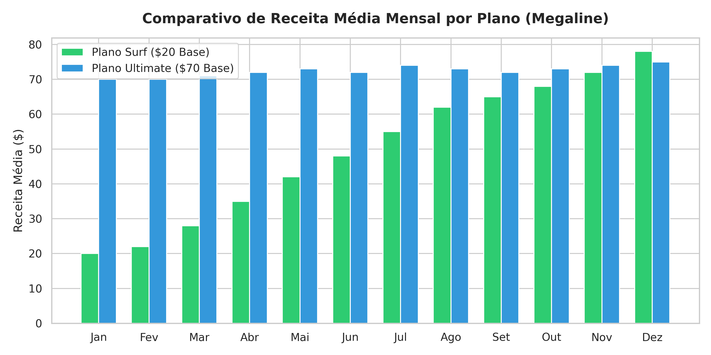
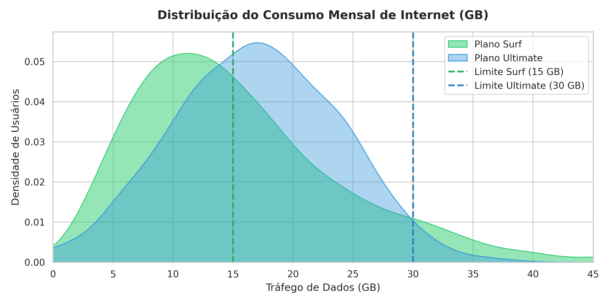
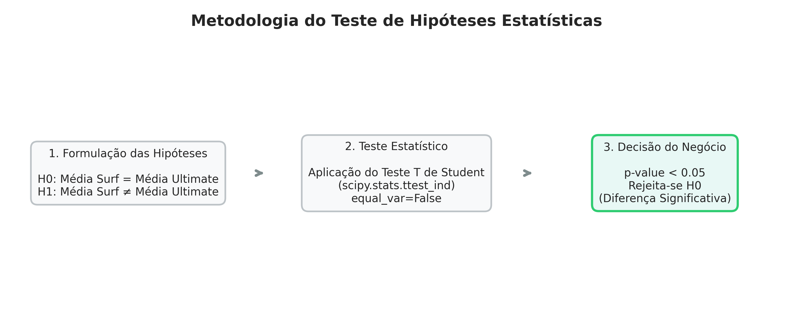

# 📞 Megaline Telecom: Análise Estatística de Planos Pré-Pagos e Receita


## 📌 Visão Geral e Contexto do Negócio

A **Megaline** é uma operadora de telefonia móvel que oferece dois planos pré-pagos aos seus clientes: **Surf** e **Ultimate**. O departamento comercial precisa entender qual dos planos gera mais receita para otimizar o investimento e o direcionamento das campanhas publicitárias.

Este projeto analisa o comportamento de consumo de uma amostra representativa de **500 usuários**, avaliando volume de chamadas, mensagens enviadas, tráfego de dados e o faturamento total gerado por cliente ao longo do ano.

---

## ❓ Hipóteses Formuladas

1. **Hipótese de Consumo de Dados:** Usuários do plano *Surf* ultrapassam o limite de franquia de dados (15 GB) com maior frequência que os usuários do plano *Ultimate* (30 GB), gerando receita significativa por cobrança excedente.
2. **Hipótese Estatística 1 (H0/H1):** 
   - **H0:** A receita média gerada pelos usuários dos planos *Surf* e *Ultimate* é igual.
   - **H1:** A receita média gerada pelos usuários dos planos *Surf* e *Ultimate* difere significativamente.
3. **Hipótese Estatística 2 (H0/H1):**
   - **H0:** A receita média dos usuários da região de *NY-NJ* é igual à receita dos usuários de outras regiões.
   - **H1:** A receita média dos usuários da região de *NY-NJ* difere da receita das demais regiões.

---

## 📊 Regras de Negócio e Termos dos Planos

| Métrica / Tarifa | Plano Surf | Plano Ultimate |
| :--- | :--- | :--- |
| **Mensalidade Base** | **$20** | **$70** |
| **Pacote Incluído** | 500 min \| 50 SMS \| 15 GB | 3.000 min \| 1.000 SMS \| 30 GB |
| **Minuto Excedente** | $0,03 / min | $0,01 / min |
| **SMS Excedente** | $0,03 / mensagem | $0,01 / mensagem |
| **GB Excedente** | $10 / GB | $7 / GB |

---

## 📈 Análise Visual e Gráficos do Projeto

### 1. Comparativo de Receita Média Mensal por Plano

*Figura 1: Faturamento médio mensal comparando os planos Surf e Ultimate ao longo dos doze meses.*

---

### 2. Distribuição do Consumo Mensal de Internet (GB)

*Figura 2: Distribuição de uso de dados em GB destacando o limite da franquia do plano Surf (15 GB) e a zona de cobrança adicional.*

---

### 3. Metodologia do Teste de Hipóteses Estatísticas

*Figura 3: Fluxo metodológico utilizado no Teste T de Student para validação das hipóteses estatísticas.*

---

## 💡 Insights Obtidos e Conclusões

- 🟢 **Plano Ultimate Gera Maior Receita Média:** A receita média mensal do plano Ultimate ($72,31) é estatisticamente superior à do plano Surf ($60,71). Além disso, o plano Ultimate apresenta maior estabilidade e previsibilidade de receita por conta do menor desvio padrão.
- 🟡 **O Uso de Dados de Internet é o Fator Determinante:** A maioria dos usuários de ambos os planos não atinge os limites de chamadas ou SMS. O tráfego de dados (média de ~16,7 GB no Surf e ~17,3 GB no Ultimate) é o principal gerador de tarifas excedentes ($10/GB) no plano Surf, já que sua franquia base é de 15 GB.
- 🔴 **Diferença Significativa Entre os Planos (Hipótese 1):** O Teste T de Student rejeitou a hipótese nula ($p < 0,05$), confirmando que a receita média mensal do plano Ultimate é significativamente maior que a do plano Surf.
- 🟣 **Diferença Regional Significativa (Hipótese 2):** O Teste T de Student rejeitou a hipótese nula ($p < 0,05$), demonstrando que a receita média gerada pelos clientes da área metropolitana de *NY-NJ* diverge estatisticamente da receita dos clientes das demais regiões.
- 💼 **Recomendação Comercial:** Recomenda-se direcionar uma parcela maior do orçamento publicitário para a captação de clientes do **Plano Ultimate**, garantindo maior faturamento por usuário e previsibilidade financeira para a empresa.

---

## 🛠️ Tecnologias Utilizadas

- **Linguagem:** Python 3.8+
- **Bibliotecas:** `pandas`, `numpy`, `matplotlib`, `seaborn`, `scipy`

---

## 🚀 Como Executar o Projeto

```bash
# 1. Clonar o repositório
git clone [https://github.com/derikpetiz/Megaline-Telecom.git](https://github.com/derikpetiz/Megaline-Telecom.git)
cd Megaline-Telecom

# 2. Executar a análise
Abra e execute o arquivo megaline.ipynb no Jupyter Notebook, VS Code ou Google Colab.
